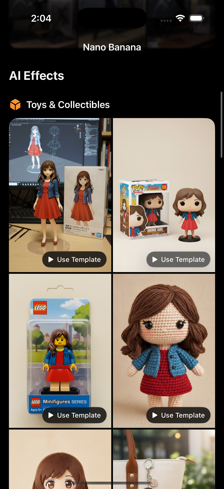
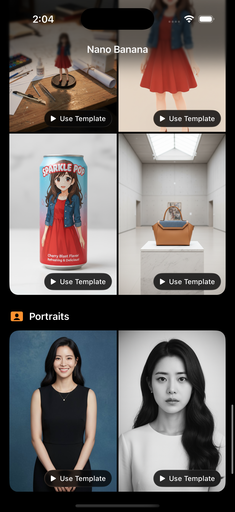
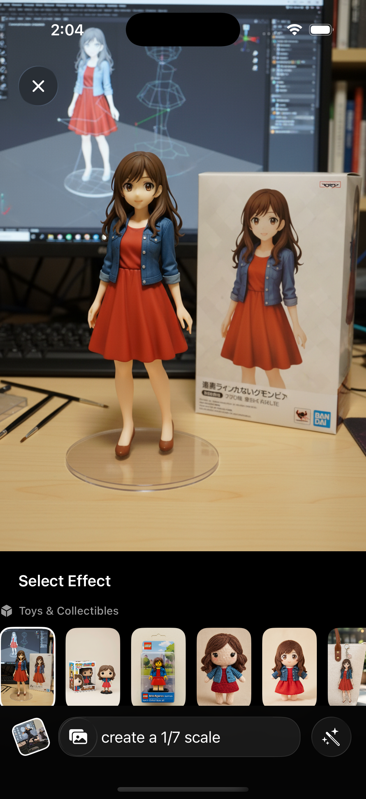

# BananaGenerator 🍌

AI Image Generator with iOS 26 Liquid Glass Design


## Demo

<p align="center">
  
  
  
</p>

## Features

- 🎨 **27 AI Effect Templates** - Covering 7 categories including toys, art, photo enhancement and more
- 🤖 **Google Gemini API** - Powerful AI image generation capabilities

## 🔑 API Key Setup

### 1. Get Gemini API Key
Visit [Google AI Studio](https://aistudio.google.com/app/apikey) to create your free API Key

### 2. Configure Project
Open file `BananaGenerator/AppConfig.swift`

```swift
// BananaGenerator/AppConfig.swift
struct GeminiAPI {
    static let apiKey = "YOUR_API_KEY_HERE"  // 👈 Replace with your API Key here
}
```

## Requirements

- **iOS 26.0+** (Required for Liquid Glass effects)
- **Xcode 26.0+**
- **Swift 5.9+**

## Templates

### 7 Categories, 27 Effects:

- **Toys & Collectibles** (6): 3D Model, Funko Pop, LEGO Minifigure, etc.
- **Art & Illustration** (4): Line Art, Marker Sketch, Van Gogh Style, etc.
- **Photo Enhancement** (3): HD Enhancement, Photorealistic, Isolate & Enhance
- **Fashion & Style** (3): Fashion Magazine, Hyper-Realistic, Anime Cosplay
- **Creative Effects** (5): Cyberpunk, Y2K Background, 3D Screen Effect, etc.
- **Product & Design** (4): Architecture Model, Product Render, Industrial Design, etc.
- **Portraits** (2): Professional Portrait, B&W Art Portrait


